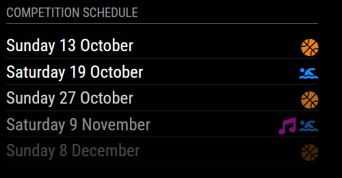
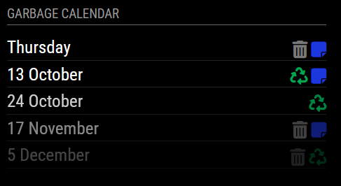

# MMM-IconSchedule

This a module for [MagicMirror²](https://github.com/MichMich/MagicMirror) which allows you to display your schedule with icons representing upcoming events. It allows you to define your own icons and their colors for each event.




#### Note
This module is based on works of Jeff Clarke `MMM-MyWastePickup` and Harm Tilburgs  `MMM-MyGarbage` and adapted to be used for anything.


## Installation
1. Navigate into your MagicMirror `modules` folder and execute<br>
`git clone https://github.com/NatyLang/MMM-MIconSchedule.git`.
2. Enter the new `MMM-IconSchedule` directory and execute `npm install`.

## Configuration
Go to the MagicMirror/config directory and edit the `config.js` file.
Add the module to your modules array in your config.js.

```
    {
			module: "MMM-IconSchedule",
			position: "top_left",
			header: "Garbage Calendar",
			config: {
					weeksToDisplay: 20,
					limitTo: 5,
					fade: true,
					dateFormat: "dddd D MMMM",
					fadePoint: 0.25,
					icons: [
						{
							name: "Garbage",
							icon: "fa fa-trash",
							color: "#787878"
						},
						{
							name: "Recycling",
							icon: "fa fa-recycle",
							color: "#00A651"
						}
					]
			}
		},
```

## Module configuration
Here is the documentation of options for the modules configuration:

<table>
  <thead>
    <tr>
      <th>Option</th>
      <th>Description</th>
    </tr>
  </thead>
  <tbody>
    <tr>
      <td><code>weeksToDisplay</code></td>
      <td>How many weeks into the future to show events.<br /><br /><strong>Number</strong><br />Default: <code>20</code></td>
    </tr>
    <tr>
      <td><code>limitTo</code></td>
      <td>Limit the display to the spcified number of events.<br /><br /><strong>Number</strong><br />Default: <code>5</code></td>
    </tr>
    <tr>
      <td><code>dateFormat</code></td>
      <td>Format to use for the date of events <br /><br /><strong>Default: </strong><code>dddd D MMMM</code> (e.g. January 18)<br /><strong>Possible values: </strong>See https://momentjs.com/</td>
    </tr>
    <tr>
      <td><code>fade</code></td>
      <td>Fade the future events to black. (Gradient).<br /><strong><br />Default: </strong><code>true</code><br /><strong>Possible values: </strong><code>true</code> or <code>false</code>
      </td>
    </tr>
    <tr>
      <td><code>fadePoint</code></td>
      <td>Where to start fade?<br /><strong><br />Default: </strong><code>0.25</code><br /><strong>Possible values: </strong><code>0</code> (top of the list) - <code>1</code> (bottom of list)
      </td>
    </tr>
    <tr>
      <td><code>icons</code></td>
      <td>List of defined icons. See icon configuration.
      </td>
    </tr>
  </tbody>
</table>

## Icons configuration
Here is the documentation of options for the icons configuration:

<table>
  <thead>
    <tr>
      <th>Option</th>
      <th>Description</th>
    </tr>
  </thead>
  <tbody>
    <tr>
      <td><code>name</code></td>
      <td>Name of icon group. This name will be used to identify entries in csv.<br /><br /><strong>REQUIRED</strong></td>
    </tr>
    <tr>
      <td><code>icon</code></td>
      <td>Name of the icon to be shown. Icons used are the Font Awesome icons (any version3). You can use any free icon available just by adding using its name eg. <code>fa-solid fa-calendar</code> <br /><br /><strong>Possible values: </strong>See https://fontawesome.com/icons/<br /><strong>REQUIRED</strong></td>
    </tr>
    <tr>
      <td><code>color</code></td>
      <td>Color of the icon in Hex-Color eg. <code>#FF0000</code> <br /><br /><strong>REQUIRED</strong></td>
    </tr>
  </tbody>
</table>


## Creating and using your Icon Schedule
You can use this module by creating your own schedule file with the name `schedule.csv`
An example file `schedule.csv` is added when you install the module.

Create a CSV based on the following template:

```
Date,Garbage,Recycling,Paper
03/10/24,1,0,1
13/10/24,0,1,1
17/11/24,1,0,1
05/12/24,1,1,0
```

Names of columns are reference to icons defined in config. If some name is not defined it will resort to default icon (white calendar icon).
For each icon you want to use, simply add an extra column with its name in the `schedule.csv` file.

Add lines for each entry date as needed. The dates don't have to be in order so you can just add to the end of your file as needed.
The date format needs to be specified as `DD/MM/YY` (e.g.: 17/11/24 for 17-November-2024)


The following is **VERY** important:
* The CSV file must be delimited using commas
* Do not put spaces between values
* The date format needs to be specified as `DD/MM/YY` (e.g.: 17/11/24 for 17-November-2024)
* The remaining fields of each line specify whether the particular icon should be shown. A value of `0` means no icon. A value of ANYTHING ELSE means icon wil be shown.

Save the file as `schedule.csv` in the `MMM-IconSchedule` directory and restart Magic Mirror²

